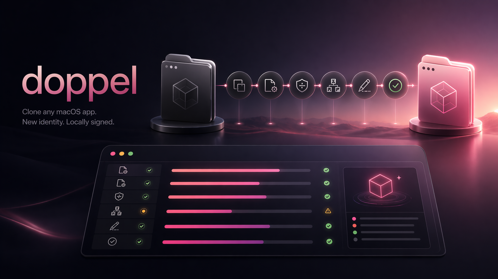

[中文](README.md) | [English](README.en.md)

# doppel

[](https://github.com/tt-a1i/doppel/actions/workflows/ci.yml)
[](https://github.com/tt-a1i/doppel/actions/workflows/release.yml)



A macOS-only tool to clone a `.app` bundle into a second, separately-launchable app instance with a new bundle identifier and local ad-hoc re-signing.

> Current status: public beta. doppel is for local multi-instance use, isolated app configuration, and clone testing on macOS. It is not a universal app multi-opener and does not bypass vendor integrity checks, App Store restrictions, SIP, or notarization.

One binary, two modes:

- **TUI** (default): `doppel` — full-screen interactive app picker → config form → live progress → result page
- **CLI**: `doppel <inspect|clone|verify|doctor> …` — scriptable, `--json` output

## Install

### Homebrew (recommended)

```bash
brew install tt-a1i/tap/doppel
```

macOS may flag the unsigned binary on first launch. If so:

```bash
xattr -dr com.apple.quarantine "$(brew --prefix)/bin/doppel"
```

### Go

```bash
go install github.com/tt-a1i/doppel/cmd/doppel@latest
```

### From source

```bash
git clone https://github.com/tt-a1i/doppel
cd doppel
make build         # produces ./doppel
make install       # copies to $GOPATH/bin (optional)
```

Requires macOS (Intel or Apple Silicon). The source / `go install` paths need Go 1.26+. At runtime, `doppel` shells out to `/usr/bin/ditto`, `/usr/bin/codesign`, and `/usr/sbin/spctl`, all standard on macOS.

## Usage

### Recommended flow

For ordinary users, use this flow:

```bash
# 1. Diagnose compatibility first
doppel doctor /Applications/cmux.app

# 2. Dry-run to confirm target path and generated bundle ID
doppel clone /Applications/cmux.app --name cmux2 --dry-run

# 3. Clone for real and verify launch survival
doppel clone /Applications/cmux.app \
  --name cmux2 \
  --launch-test
```

`clone` writes to `~/Applications/<Name>.app` by default so ordinary users do not need permission to write into `/Applications`. Use `--target /Applications/cmux2.app` when you explicitly want the system Applications folder.

`--bundle-id` is optional. When omitted, doppel generates a new ID from the source app's bundle ID and `--name`; pass `--bundle-id com.example.cmux2` only when you need a fixed identity.

`clone` runs preflight diagnostics by default. If it finds an error-level issue, such as a source app that already fails `codesign --strict`, it stops before writing to disk. Use `--skip-doctor` only when you understand the risk.

`doctor` prints a compatibility summary: `ready`, `caution`, or `blocked`. Ordinary users can start with that single line and only read the detailed findings when they need to troubleshoot.

### Interactive (TUI)

```bash
doppel
```

Launches a full-screen picker that scans `/Applications`, `/Applications/Utilities`, and `~/Applications`. Pick an app and enter a new name; the bundle ID is generated automatically and can still be overridden. The TUI runs a short launch test after signing by default. If the target app is not listed, press `p` and enter the `.app` path manually.

### CLI

```bash
# Enumerate installable apps (agent-friendly)
doppel list
doppel list --json

# Inspect a specific bundle
doppel inspect /Applications/cmux.app
doppel inspect /Applications/cmux.app --json

# Dry-run (derive plan, touch nothing)
doppel clone /Applications/cmux.app --name cmux2 --dry-run

# Real clone
doppel clone /Applications/cmux.app \
  --name cmux2 \
  --launch-test

# Manually pin the bundle ID when you need a fixed identity
doppel clone /Applications/cmux.app --name cmux2 --bundle-id com.example.cmux2 --dry-run

# Re-clone over an existing target (deletes target first; target must end in .app)
doppel clone /Applications/cmux.app --name cmux2 --force

doppel verify ~/Applications/cmux2.app
doppel doctor /Applications/cmux.app
```

Global flags: `--json` (structured output), `--verbose`.
Run `doppel <cmd> --help` for per-command flag lists.

### Exit codes (for scripting)

| Code | Meaning |
|---|---|
| 0 | OK |
| 1 | general error |
| 2 | invalid input (bad path, bad bundle id, target exists without `--force`, etc.) |
| 3 | unsupported environment (not macOS) |
| 4–9 | stage-specific failures: copy / plist / sign / verify / launch-test / inspect |

## How It Works

The clone pipeline has six stages, each emitted as a stage event for the TUI / CLI to render:

1. **copy** — `/usr/bin/ditto` preserves xattrs, ACLs, and resource forks that `cp` can't
2. **plist** — rewrites `CFBundleIdentifier`, `CFBundleName`, `CFBundleDisplayName`; also rewrites helper bundle IDs that embed the parent ID (Electron pattern)
3. **entitlements** — extracts from source, strips identity-bound keys (`application-identifier`, `keychain-access-groups`, team-identifier, etc.) that would fail after an ad-hoc re-sign
4. **discover** — walks `Contents/Frameworks`, `XPCServices`, `PlugIns`, `Helpers`, `LoginItems` for nested signables, sorted deepest-first
5. **resign** — ad-hoc (`codesign --sign -`) in post-order: deepest items first, outer bundle last
6. **verify** — `codesign --verify --deep --strict` + optional `spctl --assess`

Known trade-offs:

- **Ad-hoc signing is local-launchable, not vendor-trust-valid.** `spctl` will reject the clone; Gatekeeper will prompt on first launch. That's normal — local ad-hoc signatures are what Apple wants to see for local dev builds, not distribution.
- **Never modifies the source bundle.** Source app is treated read-only end to end.
- **Defaults to `~/Applications`.** This avoids admin permissions; pass `--target` explicitly when you want the system `/Applications` folder.
- **Supports `--force` for existing `.app` targets.** doppel can delete and recreate an existing clone target, but still refuses dangerous non-`.app` paths.
- **Preflight is enabled by default.** `clone` runs doctor rules first; error-level findings block the clone, while warn/info findings are shown and the clone continues.

## What's Supported

See [`docs/support-matrix.md`](docs/support-matrix.md) for per-app results and [`docs/failure-modes.md`](docs/failure-modes.md) for the doctor rule catalog.

TL;DR: Swift/Rust/native apps clone very cleanly. Electron support is app-specific: doppel rewrites helper bundle IDs under `Contents/Frameworks/*.app`, preserves helper-compatible bundle names, and rewrites Electron `app.asar` package identity when needed. Cherry Studio is now verified as a working simultaneous second instance; Claude still fails its own `app.asar` integrity check at startup. Sparkle-updated apps clone fine but the updater will break. Sandboxed apps clone fine but start with empty containers. Apps shipped with `codesign --strict` issues on disk (e.g., Chrome's FinderInfo xattrs) are flagged before any clone runs.

Pre-release real-app regression testing is documented in [`docs/smoke-testing.md`](docs/smoke-testing.md). The Developer ID signing and notarization path is documented in [`docs/release-signing.md`](docs/release-signing.md).

## Caveats

- macOS only (enforced at startup)
- Public beta — not all apps will clone cleanly; `doctor` surfaces the common failure patterns
- App Store apps are out of scope for v1
- Does not preserve vendor notarization, update channels, or entitlement identities tied to the original team
- Does not guarantee launch for apps with strong self-integrity checks; use `--launch-test` to verify
